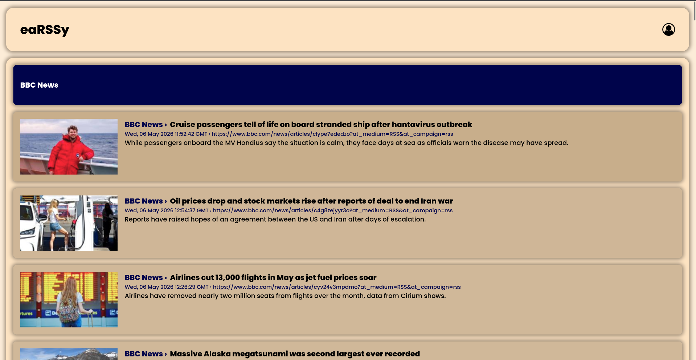

# eaRSSy - fast, modern RSS reader
<p align="center">
    
    
    <a href="https://www.codefactor.io/repository/github/jstpp/earssy"></a>
</p>

`eaRSSy` - An RSS reader with multiple features. Define your RSS channels and browse the latest news in an easy and convenient way. All your news, one simple feed. 

> [!warning]
> This project is still under construction!

## Screenshot



## Running docker
To start eaRSSy using docker execute...

```bash
docker compose up
```
...in root directory. Everything will set up automatically. App is now available at `localhost:80`. To register, simply log in with your chosen credentials—the account will be created automatically. Have fun!

> [!tip] 
> This is a development server. Do not use it in a production deployment. Use a production WSGI server instead.